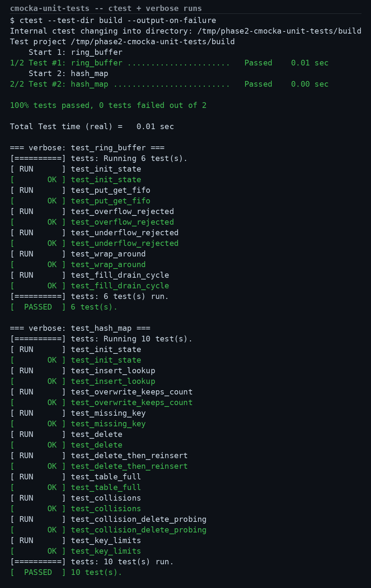

# cmocka-unit-tests

[](LICENSE) [](src/) [](https://github.com/saibontha18-hub/cmocka-unit-tests/actions/workflows/ci.yml)

Tiny examples of unit-testing embedded-style C with the [CMocka](https://cmocka.org) framework. Both modules are written in strict C99 with no dynamic allocation — the kind of building blocks that show up in firmware.

## Modules

**Ring buffer** (`src/ring_buffer.*`) — fixed-capacity byte ring (circular) buffer; the caller provides the storage array. The test suite covers: initial state, FIFO put/get ordering, overflow rejection (buffer contents preserved), underflow rejection (output untouched), index wrap-around, and repeated fill/drain cycles.

**Hash map** (`src/hash_map.*`) — fixed-capacity string-keyed hash map using open addressing with linear probing and tombstones; FNV-1a hashing, caller-provided storage, no malloc. The test suite covers: insert/lookup, overwrite (count unchanged), missing-key lookup (output untouched), delete (including double-delete and unknown keys), delete-then-reinsert (tombstone reuse), table-full behavior (new keys rejected, overwrites still allowed), deliberate hash collisions, probing past tombstones, and key-length limits.

## Prerequisites

- GCC, CMake 3.16+
- CMocka development files:
  - Debian/Ubuntu: `sudo apt install libcmocka-dev`
  - Fedora: `sudo dnf install libcmocka-devel`
  - macOS: `brew install cmocka`

## Build and run

```sh
cmake -S . -B build
cmake --build build
ctest --test-dir build --output-on-failure
```

Expected output ends with `100% tests passed, 0 tests failed`.

Every push and pull request runs the same build and test through GitHub
Actions (`.github/workflows/ci.yml`) — the CI badge at the top tracks it.

## Files

- `src/ring_buffer.h`, `src/ring_buffer.c` — ring buffer module
- `src/hash_map.h`, `src/hash_map.c` — hash map module
- `tests/test_ring_buffer.c`, `tests/test_hash_map.c` — CMocka test suites
- `CMakeLists.txt` — builds both libraries, both test binaries, and registers them with CTest

## Screenshots

Full test run from my machine — 16/16 passing:



## License

MIT
